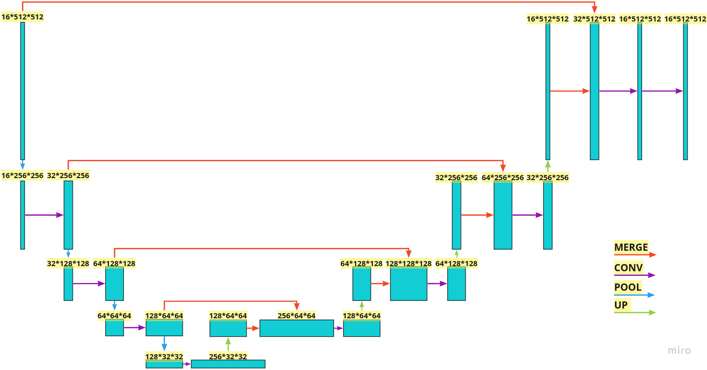
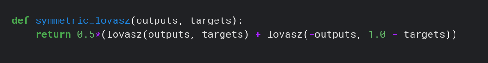
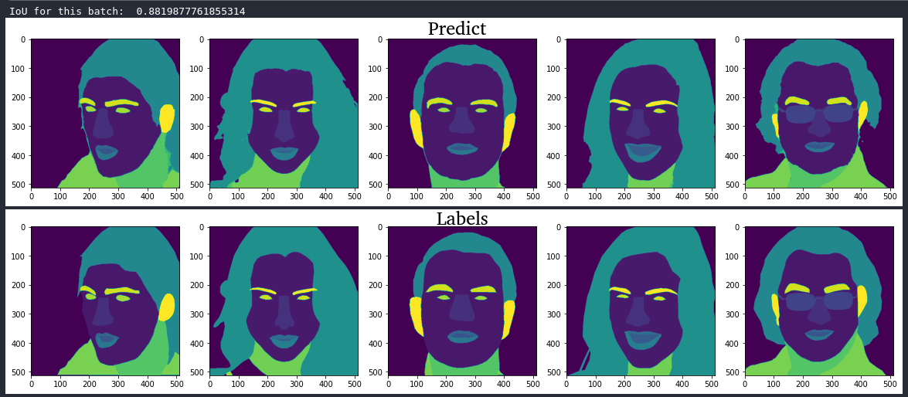

# Dataset
The [CelebAMask-HQ](https://github.com/switchablenorms/CelebAMask-HQ) dataset was taken for training, the dataset was [processed](https://github.com/Windmen05/CelebA_Segmentation/blob/main/mask_preprocess.ipynb) so that the l_eye and r_eye classes were one class, etc., which resulted in 16 classes, all of them were used for training
# Model
The model was a [U-net](https://arxiv.org/pdf/1505.04597.pdf) model, where MaxPool2d was used to reduce the dimension, and ConvTranspose2d was used to increase it

## [Training](https://github.com/Windmen05/CelebA_Segmentation/blob/main/training.ipynb)
The main loss function was taken by [LovasZ Softmax](https://arxiv.org/pdf/1705.08790.pdf), which optimizes the [Jaccard index](https://en.wikipedia.org/wiki/Jaccard_index).
In the training, I used a symmetric version of this loss

For optimization, used Adam function with standard parameters was taken, and the scheduler ReduceLROnPlateau, which reduces lr during training if the model does not show improvements on validation
## Metric
The model shows an accuracy of IoU=~63% on the entire validation set. You can get a better result if you use augmentations, which I did not use due to a lack of GPU.

Example of how the model works:

